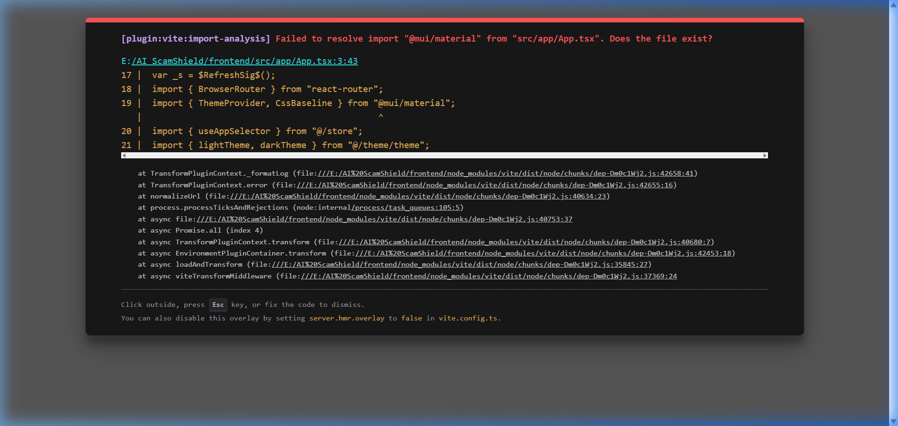

# AI ScamShield

<p align="center">
  
</p>

<p align="center">
  <strong>Detect Digital Fraud Before Money Leaves Your Account</strong>
</p>

<p align="center">
  
  
  
  
  
  
</p>

---

## 📖 Overview

**AI ScamShield** is a premium, enterprise-grade cybersecurity SaaS platform designed to intercept digital scam patterns, verify suspicious transaction request chains, flag phishing attempts, and identify malicious targets in real-time. 

With a strategy-pattern heuristic rule engine, central blacklist directory, and a stunning glassmorphic dashboard inspired by platforms like Stripe and Vercel, AI ScamShield provides the ultimate security shield for modern digital transaction flows.

---

## 📸 Interface Preview

<div align="center">
  <table>
    <tr>
      <td width="50%">
        <p align="center"><strong>Secure Entry (Login Page)</strong></p>
        
      </td>
      <td width="50%">
        <p align="center"><strong>User Preferences (Settings Panel)</strong></p>
        
      </td>
    </tr>
  </table>
</div>

---

## 🛠 Technology Stack

### Backend Component (`/backend`)
* **Runtime:** Java 24 (compatible down to JDK 21)
* **Framework:** Spring Boot 3.5.0 (Spring MVC)
* **Security:** Spring Security (Stateless JWT auth, Role-Based Access Control)
* **Heuristics & Orchestration:** Strategy-Pattern Rule Engine
* **Database & Migrations:** MySQL 8.4 LTS + Spring Data JPA + Flyway migrations
* **Data Mapping:** MapStruct + Lombok
* **Documentation:** OpenAPI 3 / Swagger UI

### Frontend Component (`/frontend`)
* **Framework:** React 19 + TypeScript
* **Build System:** Vite
* **Styling & Components:** Tailwind CSS v3 + Radix UI + `shadcn/ui`
* **Animations:** `framer-motion`
* **Charts:** Recharts
* **State Management:** Redux Toolkit (RTK)
* **HTTP Client:** Axios + Interceptor auth chain

---

## 📂 Project Directory Structure

```text
ai-scamshield/
├── backend/                   # Spring Boot 3.5 Web Application (Maven)
│   ├── src/main/java          # Clean Architecture packages (entity, repository, service, controller)
│   └── src/test/java          # Unit & Integration Tests (46 test cases)
├── frontend/                  # React 19 Client SPA (Vite + TypeScript)
│   ├── src/components         # Reusable shadcn/ui components
│   ├── src/layouts            # App Shell Layouts (Glassmorphic Header, Collapsible Sidebar)
│   ├── src/pages              # Dashboard pages (Dashboard, Settings, Sessions, Profile)
│   └── src/store              # Redux slices for global state management
├── docs/                      # Technical Architecture & Setup Documents
│   ├── images/                # Embedded UI screenshots
│   ├── architecture.md        # Technical architecture blueprints
│   └── fraud_core.md          # Fraud Core design documentation & rule extension guides
├── docker-compose.yml         # Container orchestration configuration
└── README.md                  # Project overview and developer roadmap
```

---

## 🚀 Quick Start Guide

### Prerequisites
* **Java Development Kit (JDK)**: JDK 21 or newer (JDK 24 compatible)
* **Node.js**: Node.js v20+ (npm v10+)
* **Database**: MySQL Server 8.0+ or Docker Desktop
* **Build Tool**: Apache Maven v3.9+

### Local Environment Setup

1. **Clone the Repository**
   ```bash
   git clone https://github.com/buddherohit/AI-ScamSheild.git
   cd AI-ScamSheild
   ```

2. **Initialize Environment Configurations**
   Copy the template environment file to `.env`:
   ```bash
   copy .env.example .env
   ```
   *Edit `.env` and specify your MySQL connection parameters:*
   * `DB_HOST`: Host (default: `localhost`)
   * `DB_NAME`: Database schema (default: `scamshield_db`)
   * `DB_USER`: Username (default: `scamshield_admin`)
   * `DB_PASSWORD`: Password (default: `YourSecureSuperPassword123!`)

3. **Start Core Infrastructure**
   Launch the MySQL container:
   ```bash
   docker compose up mysql -d
   ```

4. **Launch the Backend API Server**
   ```bash
   cd backend
   mvn spring-boot:run
   ```
   * The API runs on: [http://localhost:8080](http://localhost:8080)
   * Swagger Documentation is available at: [http://localhost:8080/swagger-ui/index.html](http://localhost:8080/swagger-ui/index.html)

5. **Launch the Frontend Vite Server**
   ```bash
   cd ../frontend
   npm install
   npm run dev
   ```
   * The application UI will boot on: [http://localhost:5173](http://localhost:5173)

---

## 🔑 Default Sign In Credentials

Since backend authentication components are configured as placeholders in the initial architecture phase, the React client utilizes client-side validation for access.

* **Email**: `admin@example.com`
* **Password**: `admin`

*Logging in with these credentials grants you access to the administrative workspace dashboard where live metrics are successfully queried from the backend API.*

---

## ⚖️ Fraud Core Risk Scoring Model

The **Fraud Intelligence Core** determines risk levels using a two-tier evaluation path:

1. **System Blacklist Override**: If an entity matches an active entry in the `threat_indicators` table, it is marked as **CRITICAL** with a score of `100`.
2. **Strategy-Pattern Heuristics**: Active rules in `fraud_rules` are evaluated. Standard active strategies include:
   * **`ReportCountGt5Strategy` (Weight: 20)**: Flags entities with >5 approved scam reports.
   * **`ReportCountGt20Strategy` (Weight: 30)**: Flags entities with >20 approved scam reports.
   * **`HighSeverityReportsStrategy` (Weight: 20)**: Flags entities with associated high or critical reports.
   * **`RecentFraudActivityStrategy` (Weight: 15)**: Flags entities with active fraud reports submitted within the last 24 hours.

Heuristic risk scores are capped at a maximum of `99` (keeping `100` reserved for system overrides).

---

## 🧪 Testing and Verification

Run the Maven backend tests using:
```bash
cd backend
mvn test
```
All 46 unit and integration test suites compile successfully and pass:
```text
[INFO] Results:
[INFO] 
[INFO] Tests run: 46, Failures: 0, Errors: 0, Skipped: 0
[INFO] 
[INFO] ------------------------------------------------------------------------
[INFO] BUILD SUCCESS
[INFO] ------------------------------------------------------------------------
[INFO] Total time:  10.733 s
```
