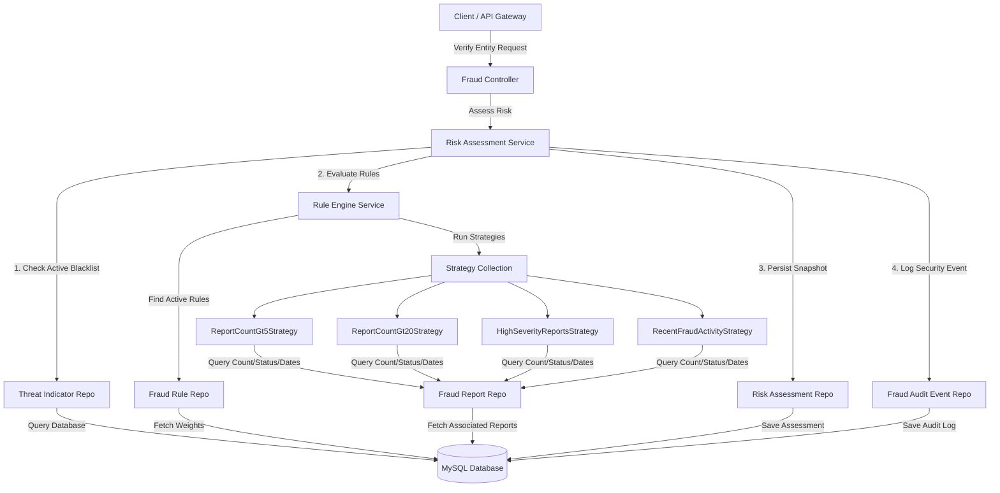

# AI ScamShield - Fraud Intelligence Core Documentation

The **Fraud Intelligence Core** is the centralized brain of the AI ScamShield platform. It acts as a shared intelligence hub that processes entity lookups, aggregates scam reports, verifies known blacklists, runs automated heuristic rules, and calculates risk scores.

---

## 🏛 Component Architecture



---

## 💾 Database Schema

The database migrations are managed via Flyway. The core schema consists of the following tables:

| Table Name | Primary Key | Description |
|---|---|---|
| `fraud_categories` | `id` (BIGINT) | Stores categorized fraud classification codes (e.g., `PHISHING`, `IDENTITY_THEFT`). |
| `reported_entities` | `id` (BIGINT) | Represents unique reported targets (e.g., `PHONE` numbers, `EMAIL` addresses, `UPI` IDs, `URL` links). |
| `fraud_reports` | `id` (BIGINT) | Stores individual scam reports filed by users, containing description, severity, status, and target entity references. |
| `threat_indicators` | `id` (BIGINT) | System-wide blacklist of known malicious values compiled from external threat feeds or admin escalations. |
| `fraud_rules` | `id` (BIGINT) | Contains configurable heuristic rule definitions and weight values. |
| `risk_assessments` | `id` (BIGINT) | Records historical risk assessment queries, score results, risk levels, and reasons. |
| `fraud_audit_events` | `id` (BIGINT) | Security auditing table capturing state transitions and administrative actions. |

---

## ⚖️ Risk Scoring Model

The risk calculation uses a dual-path pipeline:

1. **Path A: Hard Threat Blacklist (Override)**
   - If the queried entity exists as an active entry in `threat_indicators`, it is instantly classified as **CRITICAL** (Risk Score = `100`).
   - Reason: `Known Scam Indicator: Blacklisted by System`.

2. **Path B: Heuristic Scoring Engine**
   - The engine retrieves all active rules from `fraud_rules`.
   - For each rule, the corresponding `FraudRuleStrategy` evaluates the target entity.
   - If the strategy evaluates to `true`, the rule's weight is added to the total score.
   - **Score Cap**: Heuristic scores are capped at a maximum of `99` (to keep `100` reserved for active system-level blacklists).

### Risk Classification Thresholds

| Risk Level | Score Range | Description / Action |
|---|---|---|
| **SAFE** | `0` - `19` | Low risk. No recent reports or flags. |
| **LOW** | `20` - `39` | Minor risk. Single flag or older reports present. |
| **MEDIUM** | `40` - `69` | Elevated risk. Multiple reports or high-severity activity found. |
| **HIGH** | `70` - `89` | Severe threat. Broad community reports and recent fraud activities. |
| **CRITICAL** | `90` - `100` | Immediate threat. Confirmed blacklists or extreme report densities. |

---

## 🛠 Heuristic Strategies

The core provides four pre-built rule strategies:

1. **`ReportCountGt5Strategy` (Weight: 20)**
   - Triggers if the entity has more than 5 `APPROVED` reports in the system.
2. **`ReportCountGt20Strategy` (Weight: 30)**
   - Triggers if the entity has more than 20 `APPROVED` reports in the system.
3. **`HighSeverityReportsStrategy` (Weight: 20)**
   - Triggers if the entity has any `APPROVED` reports with a severity level of `HIGH` or `CRITICAL`.
4. **`RecentFraudActivityStrategy` (Weight: 15)**
   - Triggers if the entity has at least one `APPROVED` report created within the last 24 hours.

---

## 🔌 REST API Endpoints

All endpoints are mapped under `/api/v1/fraud`. Administrative endpoints are protected via Spring Security `@PreAuthorize` checks for `ADMIN` or `ANALYST` roles.

### Public Lookup / Report
* **`POST /api/v1/fraud/verify`**
  - Performs real-time risk scoring for a target.
  - Body: `{"type": "EMAIL", "value": "scam@attacker.com"}`
* **`POST /api/v1/fraud/report`**
  - Submits a new community report.
  - Body: `{"entityType": "PHONE", "entityValue": "+15550199", "categoryCode": "PHISHING", "severity": "HIGH", "description": "Received suspicious SMS link"}`
* **`GET /api/v1/fraud/categories`**
  - Retrieves active category options.

### Administrative Console
* **`POST /api/v1/fraud/report/{id}/approve`** (Approve report, updating status to `APPROVED`)
* **`POST /api/v1/fraud/report/{id}/reject`** (Reject report)
* **`POST /api/v1/fraud/report/{id}/flag`** (Escalate report)
* **`POST /api/v1/fraud/indicator`** (Manually append new blacklist item)
* **`PUT /api/v1/fraud/indicator/{id}`** (Edit details)
* **`POST /api/v1/fraud/indicator/{id}/deactivate`** (Deactivate indicator)

---

## 💻 Developer Guide: Adding a Custom Heuristic Rule

Adding new heuristics is straightforward due to the modular design. Follow these steps:

### 1. Register the Rule in Database
Add a new Flyway migration or script to insert the rule configuration:
```sql
INSERT INTO fraud_rules (rule_key, name, description, weight, is_active)
VALUES ('RULE_SUSPICIOUS_DOMAIN', 'Suspicious Email Domain', 'Checks if the domain is a known temporary mail provider', 25, 1);
```

### 2. Implement the `FraudRuleStrategy`
Create a new class in the package `com.scamshield.fraud.rule` and annotate it with `@Component`:

```java
package com.scamshield.fraud.rule;

import com.scamshield.fraud.entity.ReportedEntity;
import org.springframework.stereotype.Component;

@Component
public class SuspiciousDomainStrategy implements FraudRuleStrategy {

    @Override
    public String getRuleKey() {
        return "RULE_SUSPICIOUS_DOMAIN";
    }

    @Override
    public boolean evaluate(ReportedEntity entity, String type, String value) {
        if (!"EMAIL".equalsIgnoreCase(type) || value == null) {
            return false;
        }
        // Custom logic to flag temporary email domains
        return value.endsWith("@tempmail.com") || value.endsWith("@throwaway.com");
    }
}
```

The Spring Context will automatically register this class and pass it into the `RuleEngineService`, binding it to the database config key `RULE_SUSPICIOUS_DOMAIN`.
